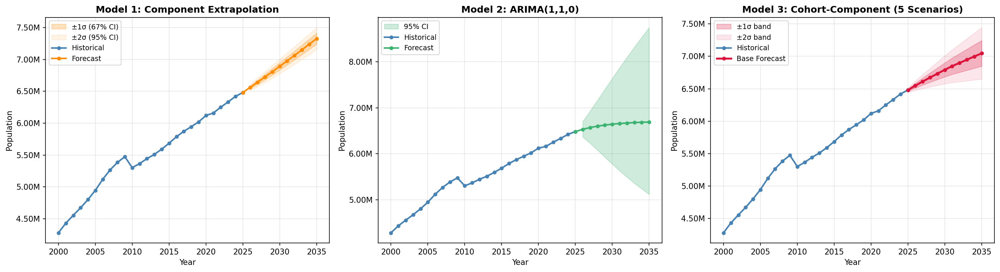
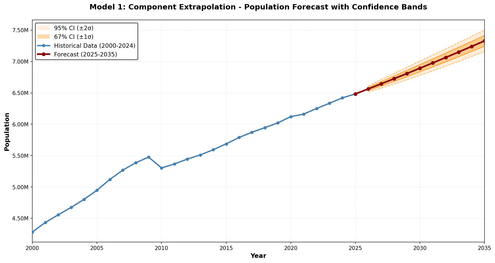
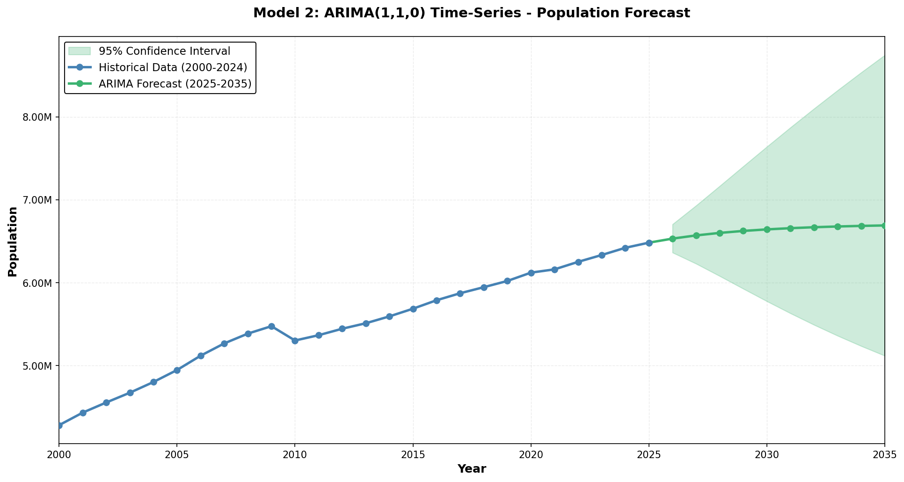
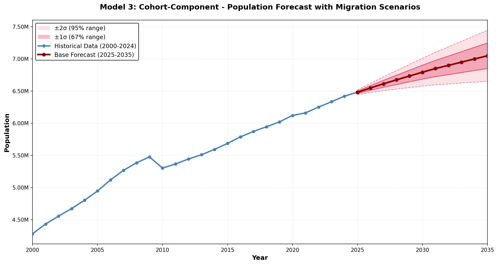

# Atlanta MSA Population Forecast

Three demographic models forecasting population growth for the Atlanta metropolitan area through 2035. We compare simple growth-rate extrapolation against statistical time-series and age-structured cohort approaches.

## Project Overview

This analysis uses 25 years of historical data (2000-2024) to project the Atlanta MSA population for the next decade. The key challenge: migration is highly volatile and dominates population change in fast-growing metros like Atlanta. We account for this by building confidence bands around each forecast and exploring multiple scenarios.

**Baseline (2024):** 6.49 million  
**Forecast range (2035):** 6.7M – 7.4M depending on model and assumptions

## Forecasts



### Individual Models

**Model 1: Component Extrapolation**

Simple approach—apply historical average rates (births, deaths, migration) forward as a constant multiplier. Uncertainty grows with square root of time.



- 2035 projection: **7.33M** 
- 95% confidence band: 7.16M – 7.50M
- Assumption: Linear growth continues at 1.3% annually

**Model 2: ARIMA Time Series**

Fits an autoregressive model to logged population. Learns from recent trends but treats growth as a statistical pattern, not demographic drivers.



- 2035 projection: **6.69M**
- 95% confidence band: 5.12M – 8.74M (very wide)
- Issue: Slow growth from 2020–2024 pulls forecast down; short time series creates uncertainty

**Model 3: Cohort-Component (Recommended)**

Tracks age cohorts separately using fertility, mortality (Gompertz), and migration assumptions. More flexible and arguably more realistic for medium-term planning. We run five migration scenarios (base ±1σ ±2σ) to show the plausible range.



- 2035 base forecast: **7.05M**
- ±1σ scenario band: 6.85M – 7.25M (67% likely range)
- ±2σ scenario band: 6.65M – 7.44M (95% plausible range)
- Natural increase (births–deaths) is stable; migration varies with economic conditions
- Scenarios capture uncertainty in net domestic and international migration

## What Drives the Differences?

- **ARIMA** is most pessimistic because the pandemic boom (2020–2021) reversed and migration normalized. Extrapolating recent slowness backward pulls the forecast down.
- **Extrapolation** is most optimistic—it spreads historical average growth evenly forward.
- **Cohort-component** falls in the middle because it separates natural increase (births − deaths, steady) from migration (volatile). Migration scenarios create the forecast fan.

**Bottom line:** Migration is the wild card. Atlanta's growth is migration-driven, not demographic. A reversal in remote-work trends or economic shifts could swing the forecast by ±500K.

## What's in here

- **popforecast.ipynb** — Notebook with all three models, step-by-step math, and full code
- **model[1-3]_*.py** — Individual model implementations
- **Final_Data_for_Modeling.xlsx** — Historical annual population, births, deaths, migration
- **population_forecast.xlsx** — Model outputs and scenarios
- **HTML docs** — Model methodology references

## Quick start

```bash
pip install -r requirements.txt
jupyter notebook popforecast.ipynb
```

Open the notebook to see the analysis from data load through visualization. Each model section is self-contained and explained.

## Models Explained

| Model | Method | Pros | Cons |
|-------|--------|------|------|
| 1 | Demographic rate avg | Simple, interpretable | Ignores trends, volatility |
| 2 | ARIMA(1,1,0) | Captures recent patterns | "Black box," wide bands |
| 3 | Age cohorts + scenarios | Flexible, explainable | Data-intensive, calibration-heavy |

### Use cases

- **Policy planning** → Model 3 (preserves age structure, easier to adjust assumptions)
- **Quick estimate** → Model 1 (5 minutes)
- **Sensitivity check** → Compare all three and note the range
